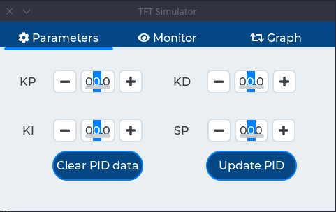
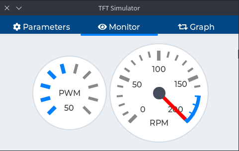
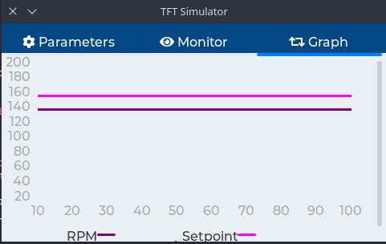
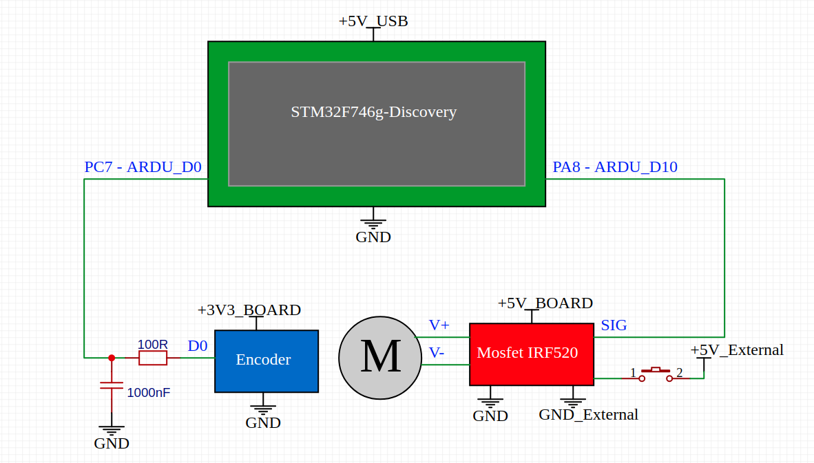

# Embedded graphical interface for PID control
This project implements an embedded graphical interface for PID control.

# Introduction
The idea behind this project is allow user to control speed motor using PID (*Proportional* - *Integral* - *Derivative*) control system from an simple graphical interface.

This project uses a microcontroller plataform (`STM32`) to implement a real PID control for DC motor control.
Development was done using `STM32F746g-Discovery` board from STMicroelectronics

# Graphical interface
The first screen contains buttons and controls for update/clear PID variables and set point

The second screen contains two widgets to monitor input and output system values, PWM duty cycle to mosfet driver and RPM

The third screen contains a graph to show data

# Dependencies

## Software
To build this project you need:
- A PC `host` runing `GNU/Linux`
- Toolchain [arm-none-gnueabi-gcc](https://developer.arm.com/tools-and-software/open-source-software/developer-tools/gnu-toolchain/gnu-rm/downloads) for `arm cortex M` microcontrollers
- `Make` tool to use `Makefile`
- Library [LVGL](https://github.com/lvgl/lvgl) (up to `7.0`)
- [OpenOCD](http://openocd.org/) tool for build/debug firmware
- [STM32CubeMX](https://www.st.com/en/development-tools/stm32cubemx.html) to change peripheral
- [CMSIS DSP](https://www.keil.com/pack/doc/CMSIS/DSP/html/index.html) to PID control

## Hardware
To run this project you need
- Devboard [STM32F746g-Discovery](https://www.st.com/en/evaluation-tools/32f746gdiscovery.html)
- DC motor 200RPM 3-6V, 
- Driver Mosfet Irf 520 
- RPM sensor (based on LM393)
- Encoder disc 20 steps
- Low pass filter

## Circuit diagram

